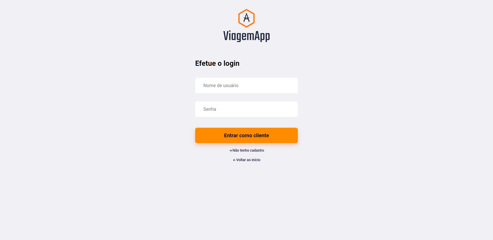
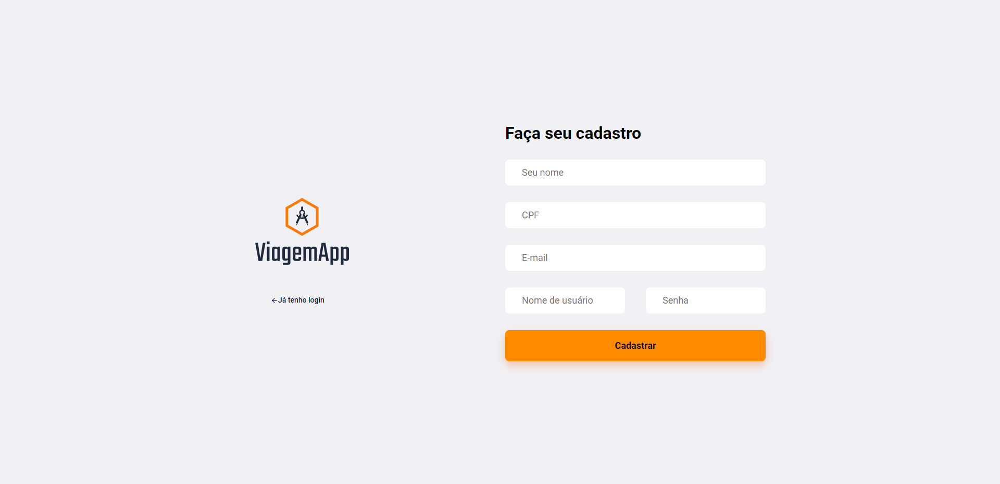

# viagemapp

Sistema de venda de viagens com interação entre cliente e fornecedor de serviço.
O backend foi feito em Spring enquanto o frontend em React.

### Como rodar:
- Executar o backend na IDE

- Na pasta frontend executar `npm start` pela linha de comando para iniciar o react.

### Exemplo de imagens do front-end

#### Desenvolvedores:
- Giovanne da Silva Santos
- Kevin Wallacy de Souza Maciel
- Noé Fernandes Carvalho Pessoa
